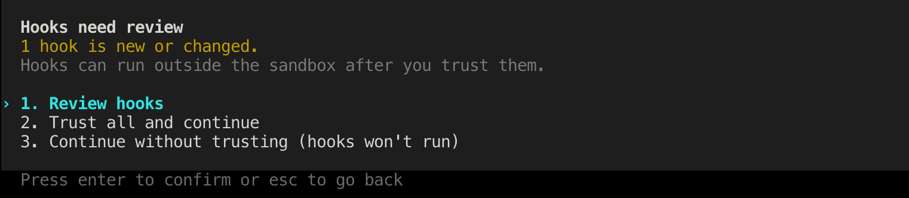

<!-- Keep this file semantically aligned with README.zh-CN.md. See CLAUDE.md. -->

# Agent Dead Drop

**Dead drops for your coding agents.**

English | [简体中文](README.zh-CN.md)

[](https://github.com/powtick/agent-deaddrop/actions/workflows/ci.yml)

Agent Dead Drop passes useful conversation context between concurrent coding-agent sessions through local Markdown files. Type a trigger command in one session and pick the drop up from another; a pre-submit hook performs the operation before the model sees it.

Saving and retrieving a drop invokes no model and consumes no model tokens. The receiving model only sees the handoff—and uses normal context tokens—after you paste and send it.

> **Project status:** early preview. Use current Claude Code and Codex releases; minimum supported versions are not yet established, and clean-install end-to-end verification is still in progress.

## Why Agent Dead Drop?

- **Offline at runtime:** no daemon, network request, cloud service, or telemetry.
- **Model-unaware controls:** `>>drop` and `>>pickup` are intercepted before they enter the transcript or trigger a model response.
- **Deterministic extraction:** Bash and `jq` mechanically filter the existing transcript; no LLM summarizes or rewrites it.
- **Cross-agent handoff:** built-in Claude Code and Codex adapters produce the same readable Markdown format.
- **Small and auditable:** one Bash core, one adapter per tool, and no user-side build step.
- **Local by default:** drops stay on the local filesystem with restrictive permissions and no built-in synchronization.

## How it works

```text
Session A:  >>drop auth-debug 2
                      │
                      │ pre-submit hook; trigger is blocked
                      ▼
        ~/.deaddrop/drops/<project>/auth-debug.md
                      │
                      ▼
Session B:  >>pickup auth-debug  ──► host clipboard ──► paste, annotate, send
```

1. In session A, `>>drop` receives the transcript path from the agent's pre-submit hook and extracts the visible user/agent conversation.
2. The core writes a versioned Markdown drop atomically under `~/.deaddrop/`.
3. In session B, `>>pickup` lists drops or copies one to the clipboard of the machine running the agent CLI and hook. In a remote session, add `-p` to show the drop in the hook result instead, then copy it from your local terminal or client UI.

Both trigger commands are handled on the agent CLI host and blocked from the model. Ordinary prompts pass through untouched.

## Requirements and support

| Area | Supported |
| --- | --- |
| Agent integrations | Claude Code and Codex |
| Operating systems | macOS and Linux; WSL2 is the supported Windows environment |
| Native Windows shells | cmd, PowerShell, and Git Bash are not yet adapted or verified |
| Runtime | Bash 3.2+, `jq` 1.6+, and standard Unix command-line tools |
| Clipboard for default pickup | `pbcopy`, `wl-copy`, `xclip`, `xsel`, or `clip.exe` on the agent CLI host |

Install `jq` first if needed:

```bash
# macOS
brew install jq

# Debian / Ubuntu / WSL2
sudo apt-get install jq
```

A clipboard tool is optional. Without a usable one, pickup falls back to printing the drop instead of copying it. Clipboard access is host-local: an agent CLI running over SSH or another remote environment cannot directly write to the client PC's clipboard. Use `>>pickup NAME -p` in that case.

WSL2 is the supported Windows path because it provides the same Linux Bash, `jq`, coreutils, and hook execution environment targeted by Agent Dead Drop. Native cmd, PowerShell, and Git Bash can differ in hook execution, path handling, and clipboard behavior; they have not been adapted or covered by end-to-end tests, so compatibility is not guaranteed. Use WSL2 for now.

## Install, update, and uninstall

Install from the published `marketplace` branch. The `main` branch contains canonical source and packaging templates, not an installable marketplace tree. Both examples below install at user level.

### Codex (user level)

Codex does not expose a plugin scope option. Marketplace and plugin state are stored under the user's `CODEX_HOME` (normally `~/.codex`).

**Install**

```bash
codex plugin marketplace add powtick/agent-deaddrop@marketplace
codex plugin add agent-deaddrop@agent-deaddrop
```

Start a new persisted local session after installation.

> **Hook review:** Codex may report that new hooks need review. This is an expected security confirmation: Agent Dead Drop registers a local `UserPromptSubmit` hook so it can intercept trigger commands before they reach the model. Open `/hooks`, inspect the Agent Dead Drop command, and trust it. Until it is trusted, `>>drop` and `>>pickup` will not run. Codex normally remembers the trust decision, but may ask again when the hook is new or its effective definition changes.

[](docs/assets/codex-hook-review.png)

*Codex startup review. Choose **Review hooks**, inspect the Agent Dead Drop command, and then trust it.*

Temporary sessions without a persisted transcript cannot be dropped.

**Update**

```bash
codex plugin marketplace upgrade agent-deaddrop
codex plugin add agent-deaddrop@agent-deaddrop
```

Start a new Codex session after updating. If the hook definition changed, review/trust it again in `/hooks`.

**Uninstall**

```bash
codex plugin remove agent-deaddrop@agent-deaddrop
codex plugin marketplace remove agent-deaddrop
```

The second command is optional and also removes the marketplace registration.

### Claude Code (user level)

**Install**

```bash
claude plugin marketplace add --scope user powtick/agent-deaddrop@marketplace
claude plugin install --scope user agent-deaddrop@agent-deaddrop
```

Start a new session after installation so the hook is loaded.

**Update**

```bash
claude plugin marketplace update agent-deaddrop
claude plugin update --scope user agent-deaddrop@agent-deaddrop
```

Start a new session after updating so the updated hook is loaded.

**Uninstall**

```bash
claude plugin uninstall --scope user agent-deaddrop@agent-deaddrop
claude plugin marketplace remove --scope user agent-deaddrop
```

The second command is optional and also removes the user-level marketplace registration.

If the repository is private, the installing machine must already have GitHub read access. Plugin installation places a plugin-scoped copy of `deaddrop` inside that agent's plugin; it does **not** install a global `deaddrop` command in your shell.

Uninstalling either plugin does not remove `~/.deaddrop`. Review and delete its `.md` and `.bak` files separately if the stored conversations are no longer needed.

## Quick start

In the session that has useful context, save the last two user/agent rounds under a memorable name:

```text
>>drop auth-debug 2
```

The hook confirms the drop name, scope, and extracted user/agent counts without invoking the model.

In another session, list the available drops:

```text
>>pickup
```

Then pick one up by name or by the number shown in the list:

```text
>>pickup auth-debug
# or
>>pickup 1
```

By default, the drop is copied to the clipboard of the machine running the agent CLI (or printed when no usable clipboard tool is available). When that CLI is remote, force the complete drop into the hook result instead:

```text
>>pickup auth-debug -p
```

Copy the returned Markdown from your local terminal or client UI, paste it into the prompt, add the task or any caveats, and send it. That final prompt is normal model input and consumes context tokens as usual.

For the complete two-session flow, including the hook output and the final pasted prompt, see the [usage example](docs/USAGE.md).

## Trigger command reference

| Trigger command | Result |
| --- | --- |
| `>>drop` | Save the full visible conversation with an automatic name. |
| `>>drop NAME` | Save the full visible conversation as `NAME`. |
| `>>drop NAME 0` | Save only the latest agent answer. |
| `>>drop NAME N` | Save the last `N` user/agent rounds. |
| `>>pickup` | Show a numbered, newest-first drop list. |
| `>>pickup NAME` | Try to copy a named drop to the agent CLI host's clipboard; show it in the hook result if the clipboard is unavailable. |
| `>>pickup NUMBER` | Do the same for the drop at that list position. |
| `>>pickup NAME -p` | Show the complete drop in the hook result instead of using a clipboard; useful for remote sessions. A list number also works in place of `NAME`. |
| `>>pickup -n N` | Show page `N` of the drop list. |
| `>>pickup -a` | Show every drop. |

Whitespace after `>>` is optional, so `>> drop` also works. A name must be a single token; it cannot be all digits, contain `/`, or start with `-`.

## What a drop contains

A drop is filtered conversation text, not an AI-generated summary and not a full execution trace.

Included:

- user-authored messages visible in the conversation;
- agent replies visible to the user, including Codex commentary and final answers;
- frontmatter with format version, source tool, scope, project, timestamps, turn counts, and source-session pointers.

Built-in adapters exclude recognized records for:

- reasoning/thinking blocks;
- tool calls and tool results;
- system/developer injections and metadata;
- inter-agent events and duplicate low-level records.

This filtering is not secret scanning or redaction. Review a drop before sharing or syncing it.

The default path is `~/.deaddrop/drops/<project>/<name>.md`. Set `DEADDROP_DIR` to move the data root. Reusing a name moves the previous drop to `<name>.md.bak` before writing the replacement.

## Advanced CLI use

The packaged hooks call the CLI internally. From a source checkout, you can invoke it directly:

```bash
bin/deaddrop help
bin/deaddrop doctor
bin/deaddrop drop /path/to/transcript.jsonl handoff 1
bin/deaddrop pickup handoff -c
bin/deaddrop pickup handoff -p
bin/deaddrop list
bin/deaddrop rm handoff
```

Manual `drop` requires an explicit transcript path because the pre-submit hook is what normally supplies it.

## Privacy and security

- Runtime drop/pickup operations stay on the agent CLI host and make no network requests.
- On supported systems, data directories use mode `0700`; drop files use `0600` and are written with same-directory temporary files plus atomic replacement.
- Drops contain original conversation text and local metadata such as `cwd` and `session_file`. They are **not encrypted**.
- With a supported clipboard tool, default pickup places the selected content on the agent CLI host's clipboard; `-p` keeps it in user-visible hook output instead.
- Reusing a name retains the prior content in a `.bak` file.

> **Sensitive data warning:** do not add `~/.deaddrop` to Git or a synced folder unless you intentionally want the contained conversations and local paths to leave this machine. Review and delete both `.md` and `.bak` files when they are no longer needed.

## Known limitations

- Handoffs currently use a shared local filesystem; cross-machine synchronization is out of scope.
- Agent composer APIs cannot prefill text without sending it, so pickup uses the execution-host clipboard or user-visible hook output and still requires a manual paste.
- A remote agent CLI cannot directly write to the client PC's clipboard. Use `>>pickup NAME -p`; very long hook results may be folded or truncated by the agent host.
- Codex temporary sessions with no persisted `transcript_path` cannot be dropped.
- Native cmd, PowerShell, and Git Bash have not been adapted or verified; use WSL2 for the supported Windows environment.
- Built-in integration currently covers Claude Code and Codex. Other tools need an adapter and their own pre-submit hook packaging.

## Troubleshooting

| Symptom | What to do |
| --- | --- |
| A trigger command reaches the model | Confirm the plugin is enabled, start a new session, and review/trust it in Codex `/hooks`. |
| `jq not found` | Install `jq` 1.6 or newer, then retry. |
| No transcript path is available | Use a persisted local session rather than a temporary session. |
| Pickup reports that the clipboard is unavailable | Install `wl-clipboard`, `xclip`, or `xsel` on Linux; macOS supplies `pbcopy`, and WSL2 normally supplies `clip.exe`. |
| Pickup succeeds remotely, but the client PC clipboard is unchanged | The clipboard belongs to the agent CLI host. Retry with `>>pickup NAME -p`, then copy the returned content from the local terminal or client UI. |
| `deaddrop: command not found` in a terminal | This is expected after plugin installation; use the trigger commands, or invoke `bin/deaddrop` from a source checkout. |

For a broader local diagnosis from a checkout, run `bin/deaddrop doctor`.

## Development and extending

Read [DESIGN.md](DESIGN.md) before changing behavior. Decisions and external research live in [ADR.md](ADR.md), and [Adding an agent](docs/ADDING-AN-AGENT.md) is the end-to-end adapter and packaging guide. To report a problem, [open an issue](https://github.com/powtick/agent-deaddrop/issues) with the agent version, operating system, and observed hook result.

The full test gate is:

```bash
tests/run.sh
```

Before submitting shell or workflow changes, also run:

```bash
shellcheck bin/deaddrop adapters/*.sh scripts/*.sh tests/run.sh
shfmt -d bin/deaddrop adapters/*.sh scripts/*.sh tests/run.sh
actionlint
```

Private or experimental adapters can be added without forking by placing `<tool>.sh` under `~/.deaddrop/adapters.d/`. A distributable integration also needs a fixture, expected extraction output, isolated plugin manifest/hook, and marketplace entry as described in the guide.
