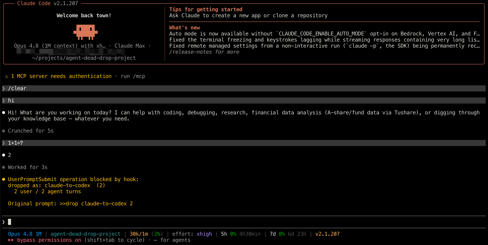
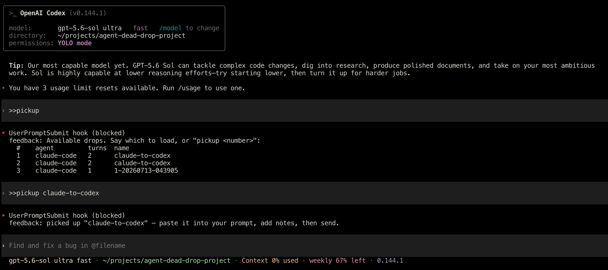

<!-- Keep this file semantically aligned with USAGE.md. See ../CLAUDE.md. -->

# Usage example

English | [简体中文](USAGE.md)

This walkthrough moves the last two rounds of an authentication-debugging conversation from one agent session to another. The output below comes from the current `deaddrop` CLI; Claude Code and Codex may render the hook result in different UI containers.

## Before you start

- Install the plugin for each agent you plan to use, then start a new session.
- In Codex, a new or changed plugin hook may require review. Open `/hooks`, inspect the Agent Dead Drop command, and trust it; the trigger commands do not run before that confirmation.
- Use a persisted local session; a temporary Codex session without a `transcript_path` cannot create a drop.
- Keep both sessions on the same machine and filesystem. Drops are local files, not network messages.

## 1. Save context in session A

Assume session A has identified why login requests return `401` and proposed a fix. Enter this trigger command in that agent's normal prompt box:

```text
>>drop claude-to-codex 2
```

The pre-submit hook intercepts the command before the model sees it. In this example, each saved round contains one agent message, so `deaddrop` returns the following result text for the agent host to display:

```text
dropped as: claude-to-codex  (2)
  2 user / 2 agent turns
```

`claude-to-codex` is the drop name. `2` keeps the last two user/agent rounds; omit it to keep the full visible conversation, or use `0` to keep only the latest agent answer. The exact agent count depends on the transcript; for example, Codex commentary and final answers can be counted as separate agent messages.

[](assets/claude-code-drop.png)

*Claude Code creating a two-round drop. The trigger command is blocked by `UserPromptSubmit`, and the result is shown to the user without invoking the model.*

## 2. List drops in session B

Open another supported agent session in the project and enter:

```text
>>pickup
```

The following assumes this is the newest drop and it was created by Claude Code. `deaddrop` returns a newest-first list for the agent host to display:

```text
Available drops. Say which to load, or "pickup <number>":
#    agent         turns  name
1    claude-code   2      claude-to-codex
```

The number is the drop's position in the current newest-first list, so existing drops can change it. The `agent` column shows the tool that created the drop; a Codex-created drop shows `codex` instead.

## 3. Pick up the drop

Select it by name or by the number from the list:

```text
>>pickup claude-to-codex
# or
>>pickup 1
```

With a supported clipboard tool on the agent CLI host, `deaddrop` returns:

```text
picked up "claude-to-codex" — paste it into your prompt, add notes, then send.
```

If no usable clipboard tool is available, `deaddrop` returns a warning followed by the complete drop instead. The agent host controls how that longer hook result is presented; copy the returned content manually.

An SSH or other remote CLI cannot directly write to the client PC's clipboard, even when a clipboard command succeeds on the remote host. Force the complete drop into the hook result instead:

```text
>>pickup claude-to-codex -p
```

`-p` overrides the default clipboard path. Copy the returned content from your local terminal or client UI; the agent host may fold or truncate very long hook results.

[](assets/codex-pickup.png)

*Codex using the default clipboard path to pick up a drop created by Claude Code. The list reflects the current local store, so its existing entries and numbering will vary.*

## 4. Paste, add the task, and send

The pickup command does not send anything to the model. Paste the copied or manually selected Markdown into session B's prompt box, add a concrete instruction after it, and then send the combined prompt. For example:

```text
<paste the copied drop here>

Continue from this handoff. Reproduce the 401, verify the proposed fix,
then update the regression test without changing the public API.
```

Only this final send becomes normal model input and consumes context tokens. The `>>drop` and `>>pickup` trigger commands themselves remain outside the conversation transcript.

## 5. Inspect the local file (optional)

The drop is stored under the project directory inside `~/.deaddrop`:

```bash
ls -l ~/.deaddrop/drops/my-project/claude-to-codex.md
```

Replace `my-project` with the basename of the directory where you created the drop. The file contains versioned frontmatter followed by `## User` and `## Agent` sections. It may include sensitive conversation text and local paths, so review it before sharing or syncing it.

## Useful variations

| Goal | Trigger command |
| --- | --- |
| Save the full visible conversation with an automatic name | `>>drop` |
| Save the full visible conversation as `parser-debug` | `>>drop parser-debug` |
| Save only the latest agent answer | `>>drop release-handoff 0` |
| Show a drop in the hook result for a remote session | `>>pickup release-handoff -p` |
| Show the next page of drops | `>>pickup -n 2` |
| Show every drop | `>>pickup -a` |

See the full [trigger command reference](../README.en.md#trigger-command-reference) and [troubleshooting guide](../README.en.md#troubleshooting) in the README.
